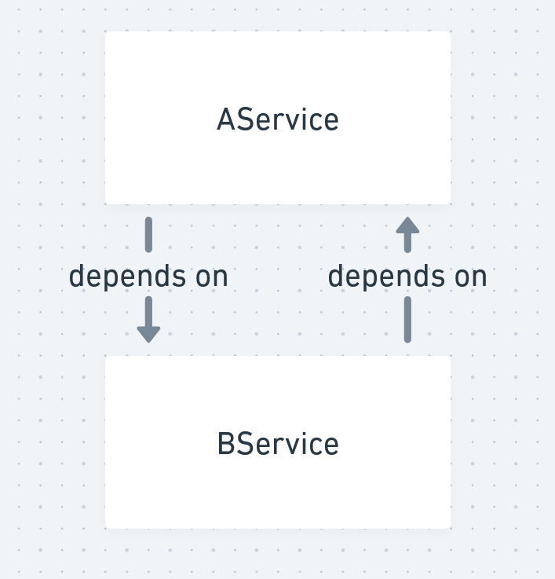

# fish
An **experiential** (*involving or based on experience and observation*) typed framework for Roblox.

This framework is inspired from [Knit](https://github.com/Sleitnick/Knit) and was created in response to the project being archived.
## Installation
**Wally & Rojo workflow:**
1. Add Knit as a Wally dependency (e.g. `fish = "stevendahfish/fish@^1"`)
1. Use Rojo to point the Wally packages to ReplicatedStorage.
## Documentation
View the [documentation](https://stevendahfish.github.io/fish/) to see how to use this framework.
## Structure
The structure of projects was tightly integrated into the framework, meaning the way Services and Controllers are organized are strict and should not be changed in order to provide typings as expected. View the [tests](https://github.com/StevenDahFish/fish/blob/master/tests) folder for an example of this.
## Limitations
### Cyclic Dependencies
When requiring two services in each other (AService requires BService which requires AService...), this create a cyclic dependency. Unfortunately, due to how requiring modules works, it's not possible to avoid this error with the current way services are imported. The only solution is to cast the type `any` in one of the services, removing its typing for that service in the process. The service must also be required outside of the global context (ex. within the Start function).

```lua
--==============--
-- ServiceA.lua --
--==============--

--// Core
local ServiceA = {}

--// Dependencies
local ServiceB = require(script.Parent.ServiceB)

return fish.service("ServiceA", ServiceA)

--==============--
-- ServiceB.lua --
--==============--

--// Core
local ServiceB = {}

function ServiceB:Start()
	local ServiceA = require(script.Parent.ServiceA) :: any -- casting type "any"
end

return fish.service("ServiceB", ServiceB)
```

